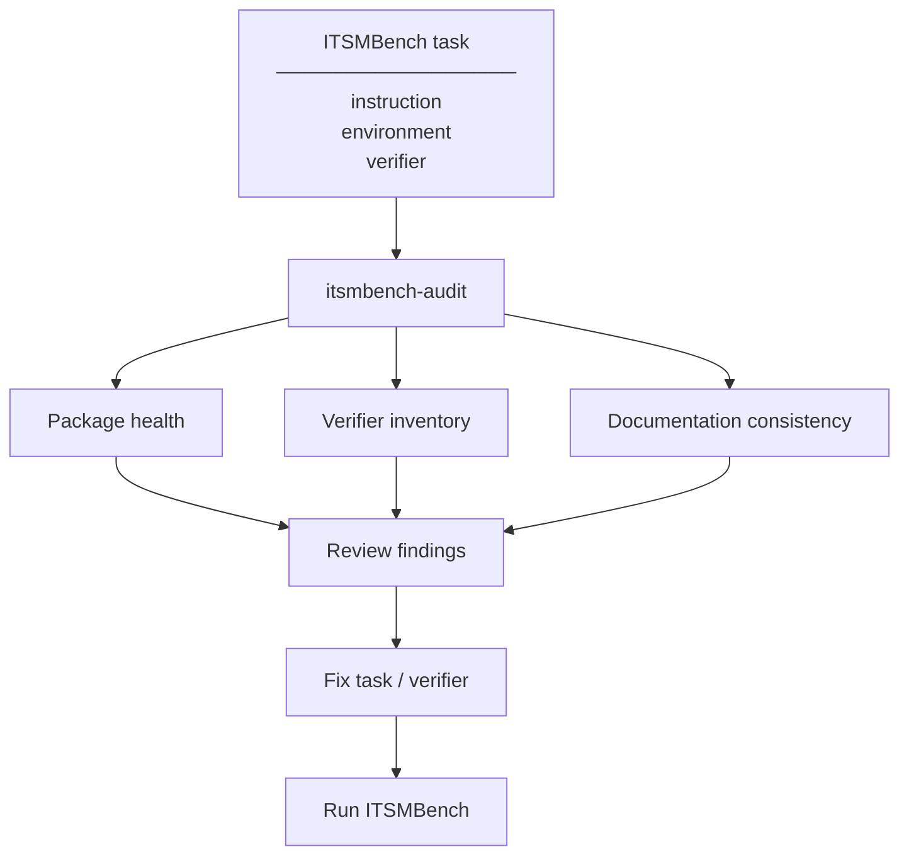
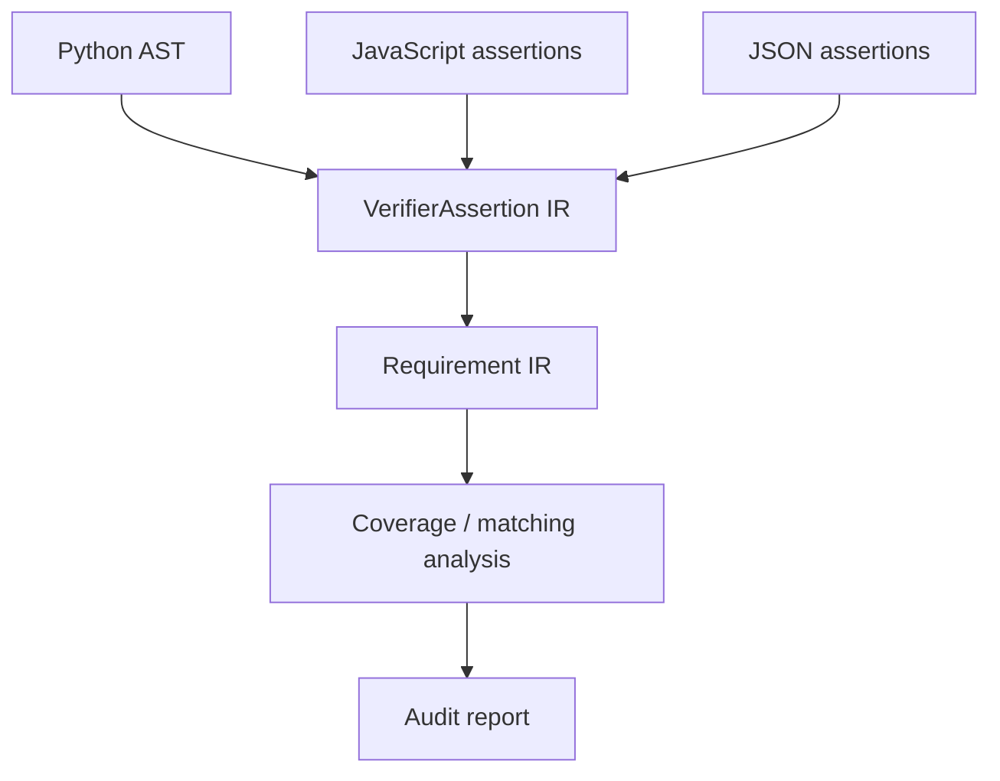
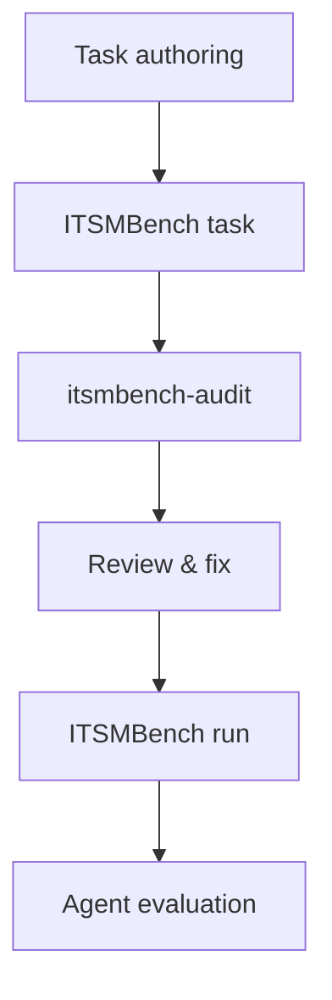

# ITSMBench Audit

Static authoring-time audit tooling for [ITSMBench](https://github.com/new-measure/ITSMBench) tasks.

ITSMBench evaluates how well AI agents perform realistic IT service-management work. Each task
places an agent in a containerised enterprise environment, gives it a ticket-style instruction,
and evaluates the resulting environment using a hidden verifier. The benchmark currently contains
tasks spanning areas such as incident management, access management, offboarding, and security
response.

**ITSMBench Audit** provides a static preflight layer for task authors. It analyses an ITSMBench
task before it is used in a benchmark run and checks whether the task package is structurally
healthy, what its verifier actually evaluates, and whether the documented task requirements appear
to correspond to the verifier''s assertions.

> **Task authoring → `itsmbench-audit` → review findings → fix → benchmark run**

---

## Why this exists

A benchmark task can look correct while still containing problems in its evaluation layer. For
example:

- a required task file may be missing;
- a verifier may contain assertions that are not reflected in the task documentation;
- a documented requirement may not appear to have corresponding verifier coverage;
- a verifier may be too complex for static analysis to fully understand;
- an assertion may only establish a final state rather than proving that a particular action occurred;
- a task may contain ambiguous or weak documentation-to-verifier mappings.

These issues are particularly important for agent benchmarks because the verifier defines what
ultimately counts as success. ITSMBench Audit is designed to surface these cases **before benchmark
execution**.

---

## What it checks

### 1. Package health

Checks the basic structure of an ITSMBench task, including expected task files, directories, and
references between local files. The goal is a simple question:

> **Can this task plausibly be executed and evaluated as an ITSMBench task?**

---

### 2. Verifier inventory

Identifies verifier tests and attempts to extract their semantic assertions. Supported verifier
sources include:

- Python test files
- JavaScript test files
- JSON-based assertion files

The analyser extracts information such as:

| Field | Description |
|---|---|
| `action` | The operation asserted |
| `object` | The resource acted upon |
| `entity` | The subject performing the action |
| `state` | The resulting or required state |
| `field` | A specific attribute under inspection |
| `expected_value` | The value the field must hold |
| `forbidden_value` | A value the field must not hold |
| `relation` | A relationship between entities |
| `predicate` | A general logical predicate |
| `scope` | The boundary within which the assertion applies |
| `provenance` | Where the assertion originates |

For Python verifiers, the analyser uses static AST-based inspection and bounded helper analysis
rather than executing the verifier. For JavaScript, it recognises common assertion idioms such as
`assert`, `expect(...).toBe(...)`, `toEqual(...)`, `toContain(...)`, and related forms. JSON
assertions are normalised into the same internal representation where their semantics can be
determined.

---

### 3. Documentation + verifier consistency

ITSMBench tasks contain natural-language requirements describing what the agent is expected to
accomplish. ITSMBench Audit compares those requirements against the semantics extracted from the
verifier. It checks both directions:

**Documentation -> verifier**
> Does the task appear to verify the requirements it tells the agent to perform?

**Verifier -> documentation**
> Does the verifier appear to enforce requirements that are not documented?

The matching system is deliberately conservative. A weak semantic relationship is reported for
review rather than silently being treated as a successful match.

---

## Static analysis, not execution

ITSMBench Audit does **not** execute an agent, task environment, or verifier. It is an
authoring-time static analysis tool. The intended workflow is:



It is therefore complementary to the benchmark itself rather than a replacement for benchmark
execution.

---

## Installation

Install from PyPI:

```sh
pip install itsmbench-audit
```

Or install the repository locally:

```sh
git clone <repository-url>
cd itsmbench-audit
pip install .
```

For development:

```sh
pip install -e .
```

---

## Usage

### Audit a single task

```sh
itsmbench-audit /path/to/ITSMBench/tasks/task-a-1
```

On Windows:

```sh
itsmbench-audit C:\path\to\ITSMBench\tasks\task-a-1
```

You can also invoke the package directly:

```sh
python -m itsmbench_audit /path/to/ITSMBench/tasks/task-a-1
```

### Audit the complete task corpus

```sh
itsmbench-audit --all /path/to/ITSMBench/tasks
```

For example:

```sh
itsmbench-audit --all C:\Users\User\projects\ITSMBench\tasks
```

The corpus mode audits every task and produces aggregate statistics across the corpus.

---

## Understanding the output

The tool distinguishes between different levels of confidence.

### `EXTRACTED`

The verifier semantics were statically extracted with sufficient confidence.

```text
[CHECK:EXTRACTED] test_account_suspended  action=suspend  entity=user  state=suspended
```

This is the strongest extraction status.

---

### `PARTIAL`

The analyser understood part of the assertion but could not establish the complete semantics.
For example, a verifier may call a helper whose return value can only be partially resolved
statically.

```text
[CHECK:PARTIAL] test_service_configuration ...  reason=helper predicate partially resolved
```

`PARTIAL` does not mean that the verifier is wrong. It means the static analyser does not have
enough information to make a complete claim.

---

### `UNEXTRACTED`

A verifier was detected, but its assertion semantics could not be statically extracted. This
should generally be reviewed manually.

```text
[CHECK:UNEXTRACTED] test_complex_workflow  reason=assertion semantics could not be statically extracted
```

---

### `UNMAPPED`

The verifier semantics were extracted, but the analyser could not find a sufficiently strong
corresponding documented requirement.

```text
[REVIEW] verifier assertion has no documented requirement
```

This is a documentation/verifier coverage finding rather than necessarily a verifier defect.

---

### `WEAK`

A documentation/verifier relationship exists, but the semantic relationship is not strong enough
to classify as a definitive match. Weak mappings are intentionally reported for review.

For example, related actions such as:

```text
remove  <->  revoke
delete  <->  remove
suspend <->  deactivate
```

may be semantically related in some enterprise workflows without being interchangeable in every
task. The tool therefore avoids treating weak equivalence as definitive proof of coverage.

---

### Important distinction: actions vs. states

The audit intentionally distinguishes an explicit **action** from a resulting **state**.

For example:

```python
account.status == "ACTIVE"
```

does not necessarily prove that the agent performed a `restore` operation.

Likewise:

```python
account.status == "DEPROVISIONED"
```

establishes the resulting state but does not necessarily prove which operation produced it.

This distinction is important for benchmark evaluation because a verifier should not receive
additional semantic meaning merely because a final state happens to resemble an action.

---

## What the tool does not do

ITSMBench Audit is intentionally limited in scope. It is **not**:

- an agent evaluator;
- a runtime monitoring system;
- a replacement for Harbor;
- a replacement for ITSMBench''s task verifiers;
- an LLM judge;
- a benchmark quality score;
- a general-purpose natural-language parser;
- a security scanner;
- a full Python or JavaScript symbolic execution engine.

The tool provides static evidence and review findings. It does not attempt to prove that a task is
universally correct.

---

## Conservative by design

False positives and false certainty are particularly undesirable in benchmark tooling. For that
reason, the analyser prefers `unknown` or `review required` over inventing semantics that cannot
be established from the source.

In particular:

- test names are secondary evidence rather than primary proof;
- final states are not automatically interpreted as actions;
- weak action equivalences are not treated as exact matches;
- ambiguous control-flow paths are marked as ambiguous;
- unresolved helper logic is surfaced rather than guessed;
- partial static extraction remains visibly partial.

The goal is not to produce the smallest possible warning count. The goal is to make the
analyser''s reasoning inspectable.

---

## Design

The analyser uses an intermediate representation for verifier assertions.



A verifier assertion can carry information including:

| Field | Description |
|---|---|
| `action` | The primary operation |
| `implied_action` | An action implied by the assertion |
| `object` | The resource under test |
| `entity` | The actor |
| `qualifier` | A modifier on the action or state |
| `state` | The required or resulting state |
| `field` | The specific attribute inspected |
| `expected_value` | The value the attribute must hold |
| `forbidden_value` | A value the attribute must not hold |
| `relation` | A relationship between entities |
| `predicate` | A general logical predicate |
| `scope` | The assertion boundary |
| `provenance` | Extraction origin |
| `raw_evidence` | The original source fragment |
| `extraction_status` | `EXTRACTED`, `PARTIAL`, or `UNEXTRACTED` |

This common representation allows different verifier formats to be analysed using the same
downstream coverage logic.

---

## Relationship to ITSMBench

[ITSMBench](https://github.com/new-measure/ITSMBench) evaluates AI agents on IT
service-management tasks in realistic, containerised enterprise environments. Tasks provide agent
instructions and are evaluated using hidden verifiers that inspect the resulting environment state.

ITSMBench Audit operates one step earlier in that lifecycle:



The original benchmark supports both remote Daytona execution and local Docker execution, making
local task development and debugging part of its workflow. ITSMBench Audit is intended to
complement that development workflow by catching static authoring issues before an actual
benchmark run.

---

## Limitations

Static analysis cannot perfectly recover arbitrary program semantics. In particular, complex
verifier logic may involve:

- dynamic dispatch;
- complex control flow;
- deeply nested helper functions;
- external API calls;
- dynamically constructed data;
- semantics that only become apparent during execution.

In these cases the tool may report `PARTIAL` or `UNEXTRACTED`. This is intentional. A static
preflight tool should expose uncertainty rather than present an unsupported interpretation as fact.

The audit also does not establish that a verifier is correct merely because its assertions are
documented. Documentation/verifier alignment is only one part of benchmark quality.

---

## Development

Clone the repository and install it in editable mode:

```sh
git clone <repository-url>
cd itsmbench-audit
pip install -e .
```

Run a syntax check:

```sh
python -m py_compile itsmbench_audit/__main__.py
```

Run the audit against an ITSMBench task:

```sh
python -m itsmbench_audit /path/to/ITSMBench/tasks/task-a-1
```

Run the complete corpus:

```sh
python -m itsmbench_audit --all /path/to/ITSMBench/tasks
```

---

## License

This project is licensed under the [MIT License](LICENSE).


