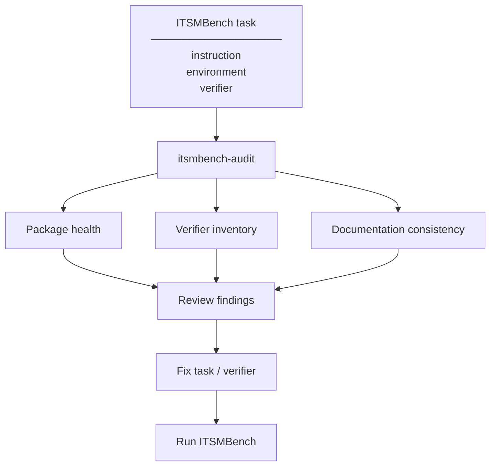
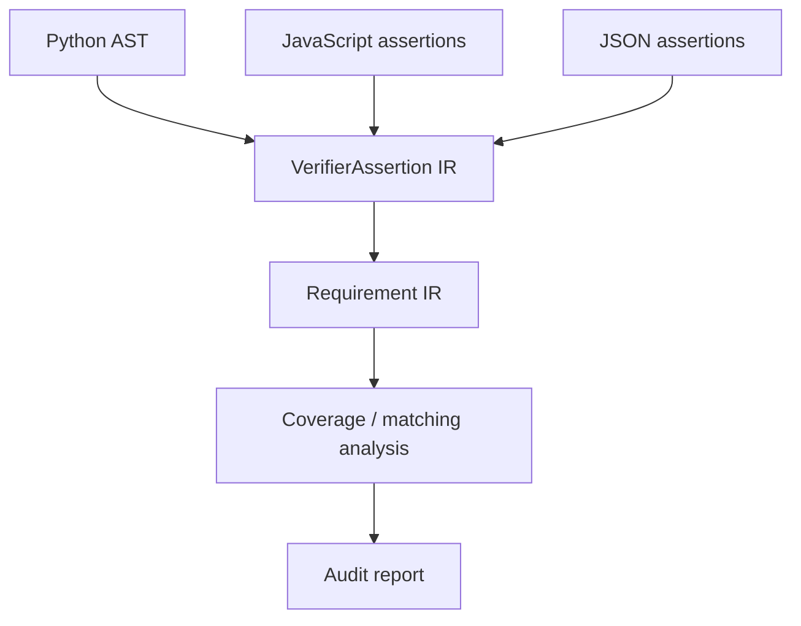
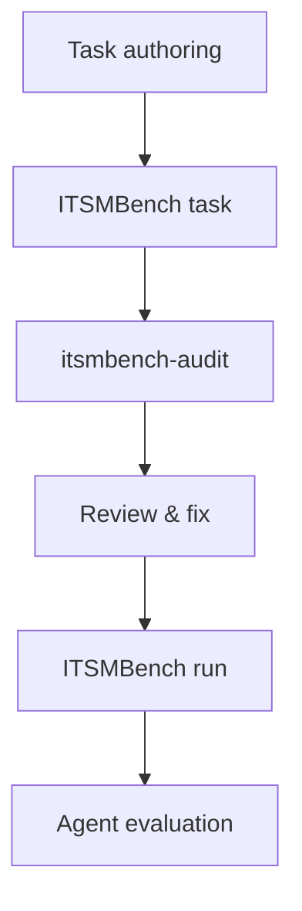

# ITSMBench Audit

Static authoring-time audit tooling for [ITSMBench](https://github.com/new-measure/ITSMBench) tasks.

ITSMBench evaluates how well AI agents perform realistic IT service-management work. Each task places an agent in a containerised enterprise environment, gives it a ticket-style instruction, and evaluates the resulting environment using a hidden verifier. The benchmark spans areas such as incident management, access management, offboarding, and security response.

ITSMBench Audit is a preflight tool for task authors. Before a task is used in a benchmark run, it checks whether the task package is structurally sound, what the verifier actually tests, and whether the documented requirements line up with what the verifier enforces.

> **Task authoring → `itsmbench-audit` → review findings → fix → benchmark run**

---

## Why this exists

A task can look correct while hiding real problems in its evaluation layer. A required file might be missing. The verifier might test things that are never mentioned in the task description. A documented requirement might have no corresponding verifier check. The verifier might be too complex to reason about statically. An assertion might confirm a final state without proving that the agent actually performed the expected action.

These problems matter because the verifier is what ultimately decides whether an agent succeeded. ITSMBench Audit surfaces them before benchmark execution.

---

## What it checks

### 1. Package health

Verifies the basic structure of an ITSMBench task: expected files, directories, and references between local files. The check is straightforward — can this task be plausibly executed and evaluated as written?

---

### 2. Verifier inventory

Reads the verifier and tries to extract what each test is actually asserting. Supported sources are Python test files, JavaScript test files, and JSON-based assertion files.

For each assertion, the analyser tries to extract structured information:

| Field | Description |
|---|---|
| `action` | The operation asserted |
| `object` | The resource acted upon |
| `entity` | The subject performing the action |
| `state` | The resulting or required state |
| `field` | A specific attribute under inspection |
| `expected_value` | The value the field must hold |
| `forbidden_value` | A value the field must not hold |
| `relation` | A relationship between entities |
| `predicate` | A general logical predicate |
| `scope` | The boundary within which the assertion applies |
| `provenance` | Where the assertion originates |

Python verifiers are analysed using static AST inspection and bounded helper analysis — the verifier is never executed. For JavaScript, the analyser recognises common assertion idioms: `assert`, `expect(...).toBe(...)`, `toEqual(...)`, `toContain(...)`, and related forms. JSON assertions are normalised into the same internal representation.

---

### 3. Documentation and verifier consistency

ITSMBench tasks describe what the agent should do in natural language. The audit compares those descriptions against the semantics extracted from the verifier, running the comparison in both directions.

First, it checks whether the verifier actually tests what the task description says to do. Then it checks the other way: whether the verifier enforces things that are never mentioned in the description.

The matching is conservative. A weak or ambiguous relationship is flagged for review rather than silently counted as a pass.

---

## Static analysis, not execution

ITSMBench Audit never runs an agent, task environment, or verifier. It reads source files only.



---

## Installation

Install from PyPI:

```sh
pip install itsmbench-audit
```

Or install the repository locally:

```sh
git clone https://github.com/souro26/ITSMBench-Audit
cd itsmbench-audit
pip install .
```

For development:

```sh
pip install -e .
```

---

## Usage

### Audit a single task

```sh
itsmbench-audit /path/to/ITSMBench/tasks/task-a-1
```

On Windows:

```sh
itsmbench-audit C:\path\to\ITSMBench\tasks\task-a-1
```

You can also invoke the package directly:

```sh
python -m itsmbench_audit /path/to/ITSMBench/tasks/task-a-1
```

### Audit the complete task corpus

```sh
itsmbench-audit --all /path/to/ITSMBench/tasks
```

The corpus mode audits every task and prints aggregate statistics across the full set.

---

## Understanding the output

### `EXTRACTED`

The verifier semantics were statically extracted with enough confidence to be useful.

```text
[CHECK:EXTRACTED] test_account_suspended  action=suspend  entity=user  state=suspended
```

This is the strongest result the analyser produces.

---

### `PARTIAL`

The analyser understood part of the assertion but not all of it. This often happens when a verifier delegates logic to a helper function whose return value cannot be fully resolved from the source.

```text
[CHECK:PARTIAL] test_service_configuration ...  reason=helper predicate partially resolved
```

`PARTIAL` does not mean the verifier is broken. It means there was not enough static information to complete the extraction.

---

### `UNEXTRACTED`

A verifier test was found, but the assertion semantics could not be extracted at all. These should be reviewed manually.

```text
[CHECK:UNEXTRACTED] test_complex_workflow  reason=assertion semantics could not be statically extracted
```

---

### `UNMAPPED`

The verifier semantics were extracted, but no documented requirement matched strongly enough. This is a documentation gap finding, not necessarily a verifier defect.

```text
[REVIEW] verifier assertion has no documented requirement
```

---

### `WEAK`

A relationship between a documented requirement and a verifier assertion was found, but the match is not strong enough to count as confirmed. These are reported so authors can decide whether the relationship is intentional.

Some action pairs that trigger weak matches:

```text
remove  <->  revoke
delete  <->  remove
suspend <->  deactivate
```

These might be equivalent in one task context and meaningfully different in another. The tool does not make that call for you.

---

### Actions versus states

The audit distinguishes between what an agent did and what state resulted from it.

`account.status == "ACTIVE"` tells you the account is active. It does not prove the agent ran a `restore` operation. `account.status == "DEPROVISIONED"` tells you the account was deprovisioned, but not which operation produced that result or whether it was the right one.

A verifier that only checks final state is weaker evidence than one that confirms the specific action was taken. The audit surfaces that distinction.

---

## What the tool does not do

ITSMBench Audit reads task source files and reports what it finds. It does not evaluate agents, execute verifiers, judge output quality, or replace any part of the benchmark runtime. It is not an LLM judge, a security scanner, or a symbolic execution engine.

It produces static evidence. Whether that evidence is sufficient is a judgement for the task author.

---

## Conservative by design

The analyser is intentionally cautious. When semantics cannot be established from the source, it reports that clearly rather than guessing.

Concretely: test function names are treated as weak hints, not proof. Final states are not automatically read as actions. Similar-sounding actions are not assumed to be equivalent. Ambiguous control flow stays ambiguous. Unresolved helper logic stays unresolved. A `PARTIAL` result is reported as partial, not rounded up to `EXTRACTED`.

The output is meant to be inspectable, not optimistic.

---

## Design

Each verifier source — Python AST, JavaScript assertions, JSON — is parsed into a common intermediate representation. That IR is then compared against the requirement IR derived from the task description.



Each assertion in the IR can carry:

| Field | Description |
|---|---|
| `action` | The primary operation |
| `implied_action` | An action implied by the assertion |
| `object` | The resource under test |
| `entity` | The actor |
| `qualifier` | A modifier on the action or state |
| `state` | The required or resulting state |
| `field` | The specific attribute inspected |
| `expected_value` | The value the attribute must hold |
| `forbidden_value` | A value the attribute must not hold |
| `relation` | A relationship between entities |
| `predicate` | A general logical predicate |
| `scope` | The assertion boundary |
| `provenance` | Extraction origin |
| `raw_evidence` | The original source fragment |
| `extraction_status` | `EXTRACTED`, `PARTIAL`, or `UNEXTRACTED` |

Using a common IR means the same coverage logic applies to all verifier formats.

---

## Relationship to ITSMBench

[ITSMBench](https://github.com/new-measure/ITSMBench) runs AI agents on IT service-management tasks in containerised environments and evaluates them using hidden verifiers. ITSMBench Audit sits one step earlier, during task authoring, before the benchmark is run.



The benchmark supports both remote Daytona execution and local Docker execution. ITSMBench Audit fits into the local development part of that workflow, before anything is actually run.

---

## Limitations

Some verifier logic cannot be recovered statically. This includes dynamic dispatch, complex control flow, deeply nested helpers, external API calls, dynamically constructed data, and logic that only becomes clear at runtime.

When the analyser hits these cases it reports `PARTIAL` or `UNEXTRACTED`. That is the correct output. Surfacing uncertainty is more useful than producing a confident-sounding result that is not actually grounded in the source.

Passing the audit also does not mean the verifier is correct. It means the documentation and verifier appear consistent to a static analyser. That is one signal among several when assessing task quality.

---

## Development

```sh
git clone https://github.com/souro26/ITSMBench-Audit
cd itsmbench-audit
pip install -e .
```

Run a syntax check:

```sh
python -m py_compile itsmbench_audit/__main__.py
```

Run the audit against a task:

```sh
python -m itsmbench_audit /path/to/ITSMBench/tasks/task-a-1
```

Run the full corpus:

```sh
python -m itsmbench_audit --all /path/to/ITSMBench/tasks
```

---

## License

This project is licensed under the [MIT License](LICENSE).

